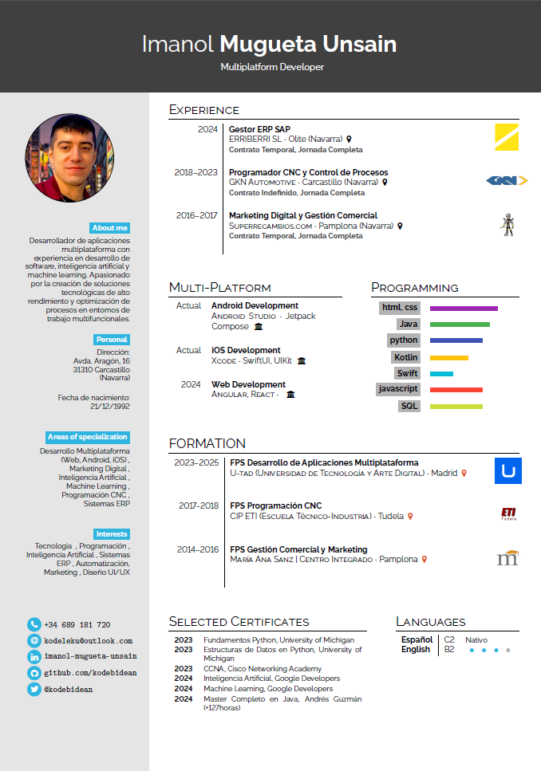

  <h1>Hola!👋 Soy IM@kodebidean</h1>

  
  

⏳<em> El tiempo es solo una dirección; el camino lo eliges tú </em>✨

<h2>Mis Principales Skills</h2>  
<ul>
  <li>⚛️Web developer</li>
  <li>📱Android developer</li>
  <li>🍏iOS developer</li>
  <li>🏢Integración ERPs</li>
  <li>🪄Marketing Digital</li>
  <li>🧠Soluciones IA</li>
  <li>🤖Machine Learning</li>
</ul>

<h2>🚀 Tecnologías y Herramientas</h2>
<table>
  <tbody>
     <h4>🦜 Lenguajes de Programación</h4>
      <tr><td></td>
<td></td>
      <td></td>
<td></td></tr>
      <tr>
<td></td>
<td></td>
    </tr>
  </tbody>
</table>
<table>
  <tbody>
    <tr>
      <h4>🖥️Lenguajes de Marcado y Diseño</h4>
      <td></td>
      <td></td>
      <td></td>
      <td></td>
</tr>
      <tr>
<td></td>
      <td></td>
      <td></td>
    </tr>
  </tbody>
</table>

  

<table>
  <tbody>
    <h4>🗄️ Bases de Datos y Servicios en la Nube</h4>
    <td></td>
    <td></td>
    <td></td>
    <td></td>
</tr>
<tr>
<td></td>
    <td></td>
    <td></td>
    <td>
</td>
</tr>
  </tbody>
</table>
<table>
  <tbody>
      <h4>🔧 IDEs y Herramientas de Desarrollo</h4>
<tr>
      <td></td>
      <td></td>
      <td></td>
      <td></td></tr>
<tr>
      <td></td>
      <td></td>
      <td></td>
      <td></td>
    </tr>
  </tbody>
</table>
<table>
  <tbody>
    <h4>⚛️ Frameworks y Librerías</h4>
    <tr><td></td>
    <td></td>
    <td></td>
    <td></td></tr>
    <tr><td></td>
    <td></td>
    <td></td>
    <td></td></tr>
  </tbody>
</table>

<table>
  <tbody>
      <h4>🔗 Intranet y Automatización</h4>
<tr>
      <td></td>
      <td></td>
      <td></td>
      <td></td></tr>
<tr>
      <td></td>
      <td></td>
    </tr>
  </tbody>
</table>

<h2>🎓 Proyectos destacados</h2>
<table>
  <thead>
    <th><b>Kode Translate</b></th>
    <th><b>Notion-GitHub Sync</b></th>
  </thead>
  <tbody>
    <tr>
      <td>
        
Aplicación que incorpora la API Codex de OpenAI para traducir entre lenguajes de programación, desarrollada con React y Flask.

        <a href="https://github.com/kodebidean/kode-translate"><b>Ver Repo</b></a>
      </td>
      <td>
        
Script en Python que automatiza la sincronización de Notion con GitHub en formato Markdown.

        <a href="https://github.com/kodebidean/notion-to-github-sync"><b>Ver Repo</b></a>
      </td>
    </tr>
  </tbody>
</table>

<h2>🌱 Actualmente trabajando en</h2>
<table>
  <thead>
    <tr>
      <th>GePeTit Cricket</th>
      <th>Proyecto Final DAM</th>
      <th>DAMcontent</th>
    </tr>
  </thead>
  <tbody>
    <tr>
      <td>App desarrollada mediante Machine Learning, que ayuda a usuarios a cumplir sus metas.</td>
      <td>Proyecto final en DAM, U-tad multiplataforma avanzado.</td>
      <td>App de automatización para conocimientos DAM, integrada con Notion.</td>
    </tr>
  </tbody>
</table>

<h2>Curriculum Vitae</h2>

  <h2>📫 Conecta conmigo</h2> 
  <table>
    <tbody>
      <tr>
        <td>
          
        </td>
        <td>
          
        </td>
        <td>
          
        </td>
        <td>
          
        </td>
      </tr>
    </tbody>
  </table>
  

    
  

🦋<em> Creo que cada línea de código es una oportunidad para construir algo significativo.</em><em> Mi meta es desarrollar soluciones que hagan la diferencia, recordándonos que lo imposible no existe, solo se necesita creer e ir por ello.</em>🌻

   <small><strong><em>kodebidean:</em></strong> En el flujo del código</small>

